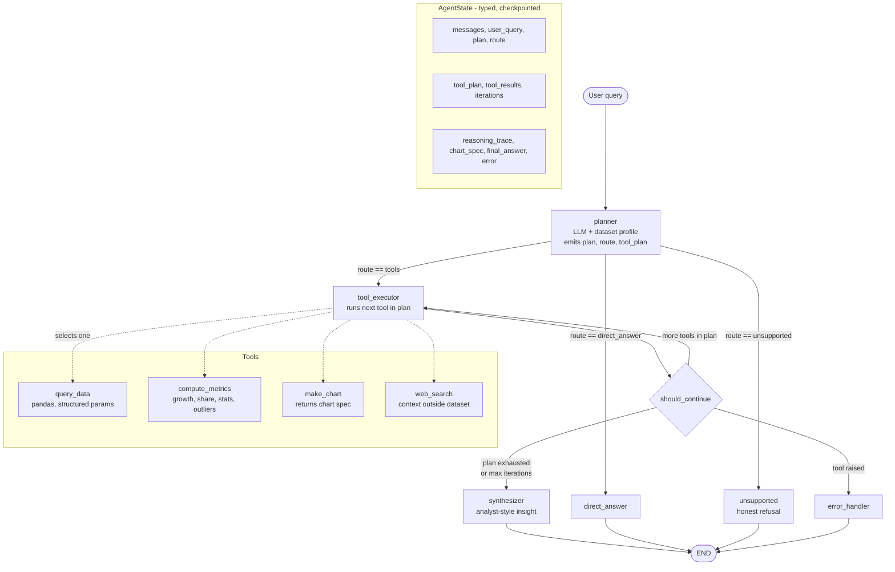

# Insight Copilot — Architecture Specification

This is the contract Antigravity builds against. Don't improvise the graph shape; build exactly this.

---

## 1. Repo structure

```
insight-copilot/
├── README.md
├── WRITEUP.md
├── .gitignore
├── .env.example
├── data/
│   └── global_superstore.csv
├── docs/
│   ├── architecture.md     # this file, trimmed
│   └── graph.mmd           # Mermaid source
├── backend/                # FastAPI + LangGraph agent
│   ├── main.py             # FastAPI app entrypoint — routes only, no agent logic
│   ├── requirements.txt
│   └── src/
│       ├── __init__.py
│       ├── config.py       # env/secrets loading, get_llm() factory, DB connection
│       ├── data.py         # cached dataset loader + derived columns
│       ├── schema.py       # dataset profile injected into prompts
│       ├── state.py        # AgentState TypedDict
│       ├── prompts.py      # all prompt templates, one place
│       ├── tools/
│       │   ├── __init__.py     # TOOL_REGISTRY
│       │   ├── query_data.py
│       │   ├── compute_metrics.py
│       │   ├── make_chart.py
│       │   └── web_search.py
│       ├── nodes.py        # planner, tool_executor, synthesizer, unsupported, error_handler
│       ├── routers.py      # conditional edge functions
│       └── graph.py        # build_graph() -> compiled StateGraph with PostgresSaver
└── frontend/               # Next.js React app
    ├── package.json
    ├── next.config.js
    ├── .env.local.example
    └── src/
        ├── app/
        │   ├── page.tsx          # main chat page
        │   └── layout.tsx
        ├── components/
        │   ├── ChatWindow.tsx
        │   ├── ReasoningPanel.tsx  # collapsible reasoning trace
        │   ├── ChartCanvas.tsx     # inline Plotly rendering
        │   ├── MessageBubble.tsx
        │   └── Sidebar.tsx         # dataset summary + example starters
        └── lib/
            ├── api.ts          # fetch/SSE client pointing at FastAPI backend
            └── types.ts        # TypeScript mirrors of AgentState fields
```

---

## 2. State object

```python
# src/state.py
from typing import TypedDict, Annotated, Literal, Any
from langgraph.graph.message import add_messages

class ReasoningStep(TypedDict):
    stage: Literal["plan", "tool_call", "tool_result", "synthesis", "error"]
    title: str
    detail: str
    payload: dict[str, Any] | None

class AgentState(TypedDict):
    # conversation
    messages: Annotated[list, add_messages]

    # planning
    user_query: str
    plan: str                      # natural-language rationale shown to the user
    route: Literal["tools", "direct_answer", "unsupported"]
    tool_plan: list[dict]          # [{"tool": "query_data", "why": "...", "args": {...}}]

    # execution
    tool_results: list[dict]       # [{"tool": ..., "ok": bool, "data": ..., "summary": str}]
    iterations: int                # guard against loops, max 4

    # output
    reasoning_trace: list[ReasoningStep]
    chart_spec: dict | None
    final_answer: str
    error: str | None
```

Notes:
- `messages` uses the `add_messages` reducer so history accumulates correctly.
- `reasoning_trace` is **structured**, not a string. The UI renders it; a string would force the UI to parse prose.
- `iterations` is what stops a bad plan from looping forever.

---

## 3. Nodes

### `planner`
Input: `user_query`, dataset profile from `schema.py`, last N messages.
Output: `plan`, `route`, `tool_plan`, appends a `plan` step to the trace.

Must return **structured JSON** (use `llm.with_structured_output(PlanModel)` with a Pydantic model). Never parse prose.

The prompt receives the dataset profile — column names, dtypes, distinct values for `Region`/`Category`/`Segment`, the min and max order date. This is what stops the agent inventing a column that doesn't exist.

The planner classifies into:
- `direct_answer` — greetings, "what can you do", meta questions about the agent itself
- `tools` — anything answerable from the dataset or from web context
- `unsupported` — out of scope, no tool fits (booking, personal advice, data we don't have)

### `tool_executor`
Takes the **next unexecuted** entry from `tool_plan`, runs it, appends `tool_call` and `tool_result` steps to the trace, increments `iterations`, and appends to `tool_results`.

Runs one tool per visit. Multi-tool sequences happen by looping back through the `should_continue` edge — that's what makes the second iteration visible in the trace.

After executing, it may **re-plan**: if the tool result changes what's needed next (e.g. the query returned region totals and now a growth rate is needed), it can append to `tool_plan`.

### `synthesizer`
Takes `user_query` + `tool_results` + conversation history. Produces `final_answer` in the mandated three-part shape:
1. Direct answer to the question asked
2. The supporting numbers, inline in prose
3. One line: what stands out / why it matters

Explicitly instructed **not** to reproduce the tool output as a table unless the user asked for a table.

### `direct_answer`
Cheap node for greetings and capability questions. No tools. Mentions what the agent can do and offers example questions.

### `unsupported`
Returns an honest refusal naming what it *can* do instead. This is scored — do not let the planner route these to tools.

### `error_handler`
Catches tool failures. Appends an `error` step, produces a user-facing message that says what failed and suggests a rephrasing. Never surfaces a traceback.

---

## 4. Edges

```python
graph.add_edge(START, "planner")

graph.add_conditional_edges(
    "planner",
    route_after_plan,               # reads state["route"]
    {
        "tools": "tool_executor",
        "direct_answer": "direct_answer",
        "unsupported": "unsupported",
    },
)

graph.add_conditional_edges(
    "tool_executor",
    should_continue,                # reads tool_plan remaining, iterations, error
    {
        "continue": "tool_executor",   # multi-step: loop back
        "synthesize": "synthesizer",
        "error": "error_handler",
    },
)

graph.add_edge("synthesizer", END)
graph.add_edge("direct_answer", END)
graph.add_edge("unsupported", END)
graph.add_edge("error_handler", END)
```

`should_continue` logic, in order:
1. `state["error"]` is set → `"error"`
2. `state["iterations"] >= 4` → `"synthesize"` (fail safe, don't loop)
3. unexecuted entries remain in `tool_plan` → `"continue"`
4. otherwise → `"synthesize"`

Compile with:
```python
from langgraph.checkpoint.postgres import PostgresSaver
import psycopg

# DATABASE_URL loaded from environment (Neon.tech connection string)
conn = psycopg.connect(os.environ["DATABASE_URL"])
checkpointer = PostgresSaver(conn)
checkpointer.setup()  # creates tables on first run
graph.compile(checkpointer=checkpointer)
```
Invoke with `config={"configurable": {"thread_id": thread_id}}` where `thread_id` is sent by the frontend on every request and stored in the user's `localStorage`.

> **Why PostgresSaver over MemorySaver:** `MemorySaver` is in-process; the full conversation state evaporates on every Render cold start or redeploy. `PostgresSaver` on Neon.tech persists all checkpointed state permanently, meaning follow-up questions (`"what about the other region?"`) still resolve correctly after a 15-minute idle restart — directly satisfying checklist item 5 ("Context is preserved across graph turns").

> **Render tier:** Use **Render Starter ($7/month)** during evaluation week. The free tier's 512 MB RAM cap is frequently breached by pandas + LangGraph + psycopg in the same process; the Starter plan provides 2 GB RAM and no sleep. If using Free tier, apply all dtype mitigations in `data.py` (see `00_ROADMAP.md` scope section) and keep the in-memory DataFrame under 40 MB.

---

## 5. Diagram

Save as `docs/graph.mmd` and embed in the README. GitHub renders Mermaid natively, which satisfies the architecture-diagram deliverable with zero extra tooling.



---

## 6. UI contract (`frontend/` + `backend/main.py`)

### FastAPI endpoints (`backend/main.py`)

| Endpoint | Method | Description |
|---|---|---|
| `/health` | GET | Liveness probe; Render uses this to confirm the service is up. |
| `/api/chat` | POST | Accepts `{query, thread_id}`; streams back SSE events with `AgentState` snapshots. |
| `/api/threads` | GET | Lists all stored thread IDs for the conversation history sidebar. |
| `/api/threads/{thread_id}` | GET | Returns the full message history for a given thread. |
| `/api/dataset/profile` | GET | Returns the dataset profile (rows, date range, column list, categories) for the sidebar summary. |

**Hard rule:** `main.py` imports `build_graph()` and route handlers only. No agent logic, no tool imports, no pandas in `main.py`.

### Next.js UI layout

```
┌─ Sidebar ──────────────┬─ Main ────────────────────────────────┐
│ Dataset summary        │ Chat messages                         │
│ (rows, date range,     │                                       │
│  regions, categories)  │ [user message]                        │
│                        │                                       │
│ Past conversations     │ [assistant message]                   │
│ (thread history list,  │   ▸ Show reasoning  (collapsible)     │
│  click to resume)      │       1. Plan: route → 'tools'        │
│                        │          Assumptions: ...             │
│ Example questions      │       2. Tool: query_data             │
│ (clickable chips)      │          Why: ...                     │
│                        │          Args: {...}                   │
│ New conversation btn   │       3. Result summary: 4 rows       │
│                        │       4. Synthesis                    │
│                        │   [Plotly chart if chart_spec]        │
│                        │                                       │
│                        │ [chat input + send button]            │
└────────────────────────┴───────────────────────────────────────┘
```

- `thread_id` is generated as `uuid4()` on first message and persisted in `localStorage`. Passing it back on every request is what links the Neon.tech checkpoint to the conversation.
- Stream with SSE (`EventSource` in the browser, `StreamingResponse` in FastAPI) so reasoning steps appear progressively — this reads far better in a demo than a spinner.
- The reasoning expander is **collapsed by default** but opens automatically on the first response so the evaluator notices it exists.
- The cold-start spinner (`"Waking up the backend…"`) fires when the SSE connection takes >3 s to receive the first event, avoiding confusion when Render is resuming.
