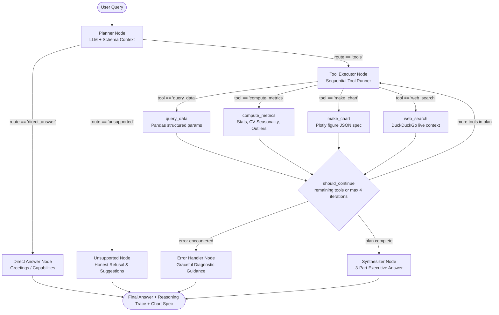

# Insight Copilot — AI Business Intelligence Analyst

A reasoning, tool-using analyst agent built with **LangGraph**, **FastAPI**, and **Next.js**. Ask questions about the **Brazilian E-Commerce (Olist)** dataset in plain English; the agent plans its approach, picks the analytical tools it needs, visualizes findings, and answers with executive-level clarity rather than raw database dumps.

---

## System Architecture



### Graph Nodes & State Flow
- **`planner`**: Analyzes the question with an injected schema profile and emits structured JSON: `rationale`, `route`, and an ordered `tool_plan`.
- **`route_after_plan`** (Conditional Edge): Directs execution to `tool_executor`, `direct_answer`, or `unsupported`.
- **`tool_executor`**: Executes queued tools sequentially, feeds previous results to downstream tools via `data_ref`, and stores chart definitions directly in `state["chart_spec"]`.
- **`should_continue`** (Conditional Edge): Enables multi-step tool loops (capped at 4 iterations) and routes to `synthesizer` or `error_handler`.
- **`synthesizer`**: Produces a structured 3-part answer:
  1. **Direct Answer**: Concise, unambiguous answer upfront.
  2. **Supporting Numbers**: Metrics, percentages, and group breakdowns woven into prose.
  3. **Strategic Takeaway / Why it Matters**: Operational implications and anomalies worth noting.
- **State Persistence**: Tracked per session `thread_id` using `MemorySaver` (local) and `PostgresSaver` (Neon PostgreSQL).

---

## Analytical Tools

| Tool | What it does | When the agent picks it |
|---|---|---|
| `query_data` | Filter, group, aggregate, and rank records via validated structured parameters | Questions asking for totals, counts, top/bottom rankings, state/category breakdowns |
| `compute_metrics` | Growth rates, share of total, descriptive stats, correlation, IQR outlier detection, trend slope, seasonality | Derived mathematical analysis on top of a query slice or raw table |
| `make_chart` | Returns interactive Plotly figure specifications (`json.loads(fig.to_json())`) | Explicit or implied requests for visual charts (line, bar, scatter, area) |
| `web_search` | DuckDuckGo web search via `ddgs` | External macroeconomic context, exchange rates, or industry benchmarks |

> **Honest Refusal (`unsupported` node)**: Out-of-scope inquiries (e.g. flight bookings, weather, cryptocurrency) receive an honest explanation of domain boundaries with recommended e-commerce analytical queries rather than hallucinations.

---

## Dataset: Brazilian E-Commerce (Olist)

- **Scale**: 112,650 consolidated customer orders across 2016–2018 (73 product categories, 27 Brazilian states).
- **Consolidated Master**: Flattened into `data/olist_master.csv` with derived date columns (`order_year`, `order_month`, `order_quarter`, `order_year_month`).
- **Memory Footprint**: Aggressive dtype downcasting (categoricals, `int8`/`int16`, `float32`) keeps active RAM usage at **~19.8 MB** (well below Render's 512MB free tier limit).

---

## Setup & Local Development

### 1. Backend (FastAPI + LangGraph)
```bash
# From workspace root
cd backend
python -m venv .venv
# On Windows:
.venv\Scripts\activate
# On macOS/Linux:
source .venv/bin/activate

pip install -r requirements.txt
cp ../.env.example .env    # Configure GEMINI_API_KEY (optional) and DATABASE_URL
uvicorn main:app --reload --port 8000
```
Backend API will be live at: `http://localhost:8000` (`/health`, `/api/dataset/profile`, `/api/chat`).

### 2. Frontend (Next.js 14)
```bash
cd frontend
npm install
npm run dev
```
Frontend UI will be live at: `http://localhost:3000`.

### 3. Verification Suite
```bash
python scripts/test_phase2.py
```

---

## Key Design Principles
1. **Structured Tool Parameters over Arbitrary Code**: Prevents syntax errors, prompt injection, and hallucinated pandas functions.
2. **Transparent Reasoning Surface**: Exposes step-by-step thoughts, tool invocations, arguments, and summaries in the UI reasoning drawer.
3. **Graceful Error Recovery**: Tool validation errors provide closest-match suggestions (`difflib.get_close_matches`), enabling the agent to re-plan instead of throwing a traceback.
