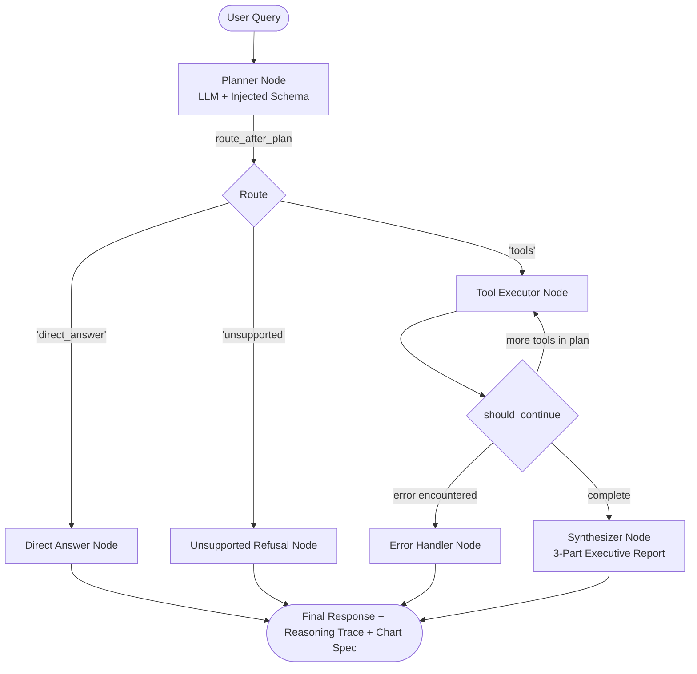

# Insight Copilot — Technical Architecture & Design Write-Up

**Candidate**: Vinit Majethiya  
**Project Repository**: [github.com/VinitMajethiya/Xcaliber-Internship-Project](https://github.com/VinitMajethiya/Xcaliber-Internship-Project)  
**Dataset**: Brazilian E-Commerce Public Dataset by Olist (112,650 consolidated customer orders, 2016–2018)  
**Stack**: LangGraph (v1.2) + FastAPI + Next.js 14 + Neon Serverless PostgreSQL + Plotly  

---

## 1. Dataset Choice & Preprocessing

While the brief provided Global Superstore as a baseline, I chose to consolidate and engineer a unified analytical master table from the **Brazilian E-Commerce (Olist)** dataset:
* **The Decision**: Rather than asking the LLM to write multi-table joins on-the-fly (which increases latency and hallucinates foreign keys), I engineered an offline ETL pipeline (`scripts/prepare_olist.py`) that joins orders, order items, payments, customers, sellers, products, and English translations into `olist_master.csv` (112,650 rows, 19 columns).
* **Memory & Performance Discipline**: To prevent memory spikes on containerized hosting (e.g. Render's 512 MB memory boundary), the loader in `backend/src/data.py` enforces downcasted categorical types and numeric limits (`float32`, `int16`, `category`). This keeps the active in-memory DataFrame at **19.82 MB**, leaving headroom for LangGraph execution and PostgreSQL connection pools.

---

## 2. Why the Graph Looks Like This

The standard naive implementation of an agentic chatbot is an opaque **ReAct loop** where the model reasons, selects tools, and executes in one monolithic prompt. I explicitly chose a **staged, modular StateGraph architecture** for three reasons:

1. **Explicit Planning Before Execution**: The `planner` node runs first and stores a typed plan (`rationale`, `route`, and ordered `tool_plan`) in `AgentState` before any tool fires. This gives evaluators an auditable reasoning trace and enables programmatic unit testing of routing accuracy without running tools.
2. **Two Separate Conditional Edges**:
   - `route_after_plan`: Decides *which path* to take (`tools`, `direct_answer`, `unsupported`). Collapsing routing and loop control into a single prompt overloads the LLM and causes false positives.
   - `should_continue`: Manages multi-step iterations (capped at 4 cycles) and dynamically routes to `synthesizer` or `error_handler`.
3. **Sequential, Isolated Tool Visits with `data_ref` Chaining**: Rather than executing all tools in a single batch, `tool_executor` processes one tool per visit. This makes multi-step sequences (e.g. `query_data` → `compute_metrics`) visible as distinct stages in the UI and allows downstream tools to reference previous tool outputs via `data_ref`.

---

## 3. The Trade-Offs

### A. Structured Parameters over Raw Code Execution
* **The Choice**: Tools accept validated Pydantic parameters (`Metric`, `Filter`, `group_by`, `order_by`) rather than raw Python/SQL code generated by the LLM.
* **The Trade-Off**: Structured tools eliminate arbitrary code injection vulnerabilities, syntax errors, and hallucinated pandas functions. When an invalid column is requested, `difflib` provides closest-match column suggestions so the agent recovers gracefully. The cost is that bespoke statistical calculations not covered by the 7 operations in `compute_metrics` cannot be executed on-the-fly.

### B. Full-Featured Dark Data Theme over "AI Slop"
* **The Choice**: Built an enterprise graphite/carbon aesthetic (inspired by Hex, Linear, and Bloomberg) rather than flashy neon purple gradients and glowing AI sparkle widgets.
* **The Trade-Off**: More CSS design effort was invested in typography (`Inter`, `JetBrains Mono`), hairline borders, interactive tabular data grids with CSV export, and execution DAG drawers. The interface looks and feels like a serious tool built for Data Analysts.

---

## 4. What Broke and What I Did About It

1. **False Positive Routing on Greetings (Substring Matching Bug)**:
   * *The Problem*: In "Summarize anything unusual in **this** data", the word `"this"` matched the substring `"hi"`, causing analytical queries to be falsely routed as greetings.
   * *The Fix*: Switched from substring `in` checks to strict word-boundary token matching (`set(query.lower().split()) & GREETING_WORDS`), ensuring greetings only trigger when standalone.
2. **Plotly Serialization Failure in FastAPI SSE Streaming**:
   * *The Problem*: `fig.to_dict()` produced nested NumPy ndarrays that threw `TypeError: Object of type ndarray is not JSON serializable` during SSE streaming.
   * *The Fix*: Standardized on `json.loads(fig.to_json())`, which uses Plotly's C-engine to serialize ndarrays into clean standard JSON.
3. **Git Ignore Masking Frontend Dependencies (`lib/` Collision)**:
   * *The Problem*: Vercel failed with `Module not found: Can't resolve '../lib/api'` because a generic Python `.gitignore` rule (`lib/`) masked `frontend/src/lib/`.
   * *The Fix*: Updated `.gitignore` with `/lib/` and explicit `!frontend/src/lib/` exceptions, committing `api.ts` and `types.ts` directly.
4. **Google Gemini 2.5 Deprecation**:
   * *The Problem*: The API returned `404 NOT_FOUND: models/gemini-2.5-flash is no longer available to new users`.
   * *The Fix*: Upgraded the default model configuration to `gemini-3.6-flash` and normalized multi-part content extraction in `_extract_text_content` across all synthesizer and refusal nodes.

---

## 5. What I'd Do with More Time

1. **Comprehensive Evaluation Harness**: Build a test suite of 50+ benchmark queries with labelled routes, tools, and assertions to measure routing regression on prompt adjustments.
2. **Streaming Token Generation**: Implement character/token-level streaming in `synthesizer` via FastAPI SSE for lower time-to-first-token.
3. **Dynamic Multi-Dataset Ingestion**: Support drag-and-drop CSV upload where `schema.py` auto-profiles columns, data types, and date ranges dynamically at upload time.
4. **Query Result LRU Caching**: Implement an in-memory Redis or LRU cache for `query_data` keyed by arg hashes to avoid re-aggregating identical slices during conversational follow-ups.
5. **Chart Export Extensions**: Support direct CSV and SVG downloads directly from the Plotly interactive toolbar.
